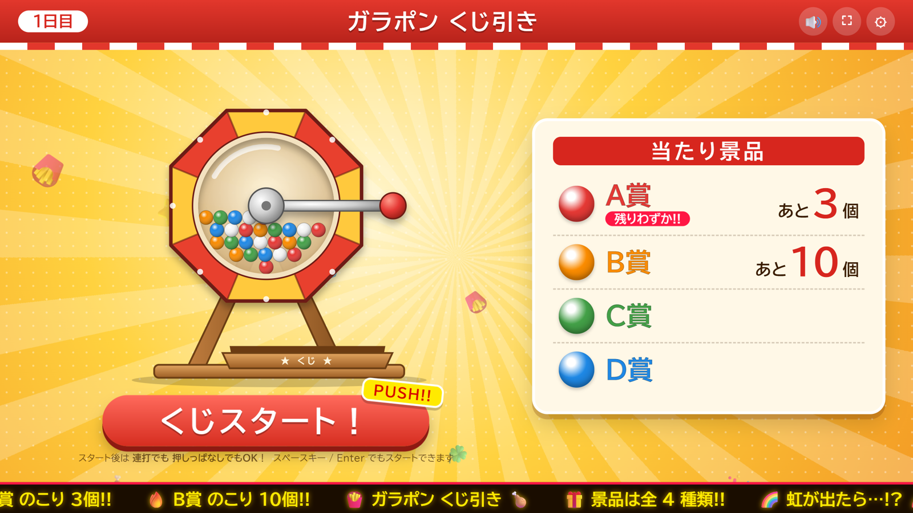
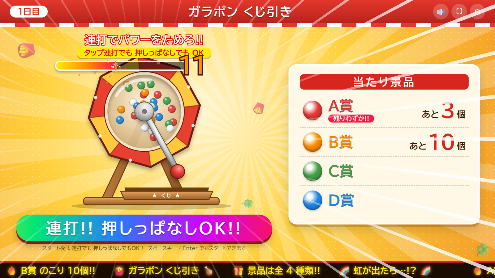
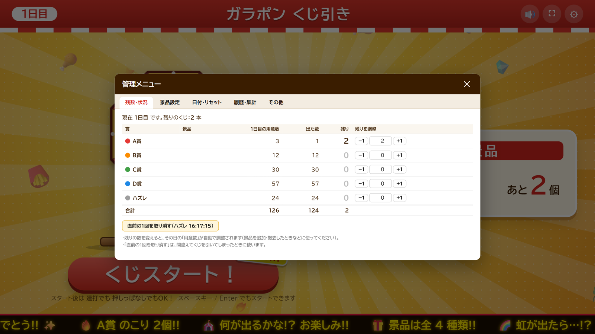

# ガラポン くじ引きアプリ

インストール不要・**オフライン**で動く、ブラウザだけで完結するガラポン式くじ引きアプリです。
外部ライブラリ・画像・音声ファイルは一切使わず、`index.html` + `js/app.js` + `css/style.css` だけで動きます（効果音も演出もプログラムで生成）。

- **デモ（GitHub Pages）**: <https://cinnamobot.github.io/garapon-gacha/>
- **アプリ本体**: リポジトリ直下の `index.html` / `css/` / `js/`（フォルダを丸ごとコピーすれば USB メモリでも動きます）



## 使い方

1. デモURLを開く（または `index.html` をダブルクリック／`start-fullscreen.bat` で Edge を全画面起動）
2. 「くじスタート！」を押す（スペースキー / Enter でも可）
3. 回転中に **連打** または **押しっぱなし** でパワーをためる → 結果表示（画面タッチ／スペースキーで閉じる）
4. 管理メニューは画面右上の ⚙ → パスワード（初期値 `0000`）

## 管理メニュー（お試し用）

画面右上の **⚙** を押してパスワードを入力すると管理メニューが開きます。**初期パスワードは `0000`** です。

- タブ構成：「残数・状況」「景品設定」「日付・リセット」「履歴・集計」「その他」
- 「景品設定」で賞の名前・景品・色・本数・演出を変更、「日付・リセット」で2日目への切替やテスト用リセットができます
- パスワードは「その他」タブで変更できます（空欄にするとパスワードなし。実際の運用では開店前に変更するのをおすすめします）

## 機能

- **くじの仕組み**：各賞の「その日の本数」を箱に入れ、残っている本数に比例した確率で1本引く方式。乱数は `crypto.getRandomValues`（偏りのない一様乱数）を使い、設定した本数より多く当たることはありません
- **演出**：連打ゲージ／予告カットイン（チャンス→激アツ→🌈確定）／？玉→ガチャ風カプセル（白→青→金→虹）／花火・紙吹雪・ファンファーレ／本日の挑戦者数／状況に応じて文面が変わる電光掲示板／完売ハンコ
- **タッチモニター対応**：指を置いたままでもゲージがたまります（押した瞬間は +1、押し続けると自動加算。長押しの右クリック扱いも抑止）。連打すればそれより速くたまります
- **2日目リセット**：1日目／2日目で本数を別々に持ち、切り替えると2日目の本数から数え直し
- **後から調整できる**：賞の名前・景品・色・本数・演出の変更、賞の追加/削除/並び替え、残り数の直接調整、直前の1回の取り消し
- **記録**：日ごとの集計、当日の履歴（新しい順）、CSV 保存（Excel で開けます）、バックアップの保存・復元
- **演出モード**：混雑時は「シンプル」にすると演出なしですぐ結果が出ます

## スクリーンショット

| 待機画面 | 抽選中（連打ゲージ） |
|---|---|
|  |  |

| 結果（A賞） | 管理メニュー |
|---|---|
|  |  |

## 動作環境

- Windows 10/11 の Edge または Chrome（`file://` でダブルクリック起動、`start-fullscreen.bat` で全画面起動）。Firefox / Safari は未検証です
- インターネット接続は不要です（外部ライブラリ・画像・音声の取得なし）。乱数は `crypto.getRandomValues`、効果音は WebAudio で生成しています
- データはブラウザの localStorage に自動保存されます（電源を切っても残ります）
  - 保存先は**ブラウザごと**です（Edge と Chrome、通常ウィンドウと InPrivate は別々）
  - `file://` で開いた場合、保存先はフォルダに依存しません（移動・コピーしても同じブラウザならデータは残ります）
  - 公開URL（https）で開くと別の保存先になります
  - ブラウザの「閲覧データの削除」で消えるため、大事なデータは 管理メニュー →「その他」→「バックアップを保存」で JSON に書き出してください

## ファイル構成

```
index.html            画面（GitHub Pages はこのリポジトリのルートを配信しています）
css/style.css         見た目
js/app.js             動作（抽選・ガラポン・演出・効果音・管理メニュー）
start-fullscreen.bat  Edge で全画面起動（Windows）
説明書.md              詳しい説明・当日の運用メモ
screenshots/          この README 用のスクリーンショット
```

詳しい説明は [説明書.md](説明書.md) を参照してください。
